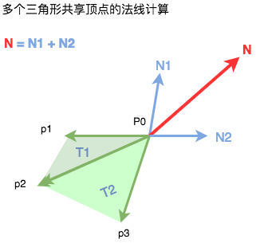
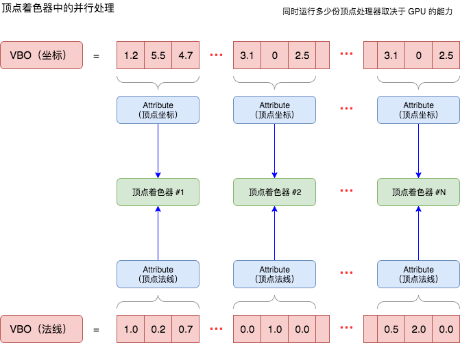

# 光照

> 在 WebGL 中，我们使用顶点着色器和片元着色器来为场景创建光照模型。在着色器中，我们可以创建一个数学模型来决定场景如何受光照影响。我们将学习不同的光照算法，并通过示例来实现它们。

本章的内容需要你对线性代数的基本知识有一定的掌握。我们将使用 glMatrix 这个 JavaScript 库来进行矢量和矩阵的数学运算，所以你不需要担心如何实现基本运算。尽管如此，你依然应该对线性代数中的基本运算有清晰的概念。

在这一章中，我们将：

- 学习光源、法线和材质。
- 学习着色和光照的区别。
- 使用高洛德着色法（Goraud Shading）和冯氏着色法（Phong Shading），以及兰伯特光照模型（Lambertian Lighting Model）和冯氏光照模型（Phong Lighting Model）。
- 定义并使用 Uniform、Attribute 和 Varying 变量。
- 使用 WebGL 的着色器语言 GLSL/ESSL。
- 讨论与着色器相关的 WebGL API。
- 继续我们关于 WebGL 作为状态机的工作原理，讨论如何设置与着色器相关的 Attribute 并读取它们的状态。

## 光照、法线和材质

在真实世界中，我们可以看见物体是因为物体会反射光线。任何物体都会根据与光源的相对位置和距离来反射光线；物体表面的朝向（在图形学中用法线向量表示）和物体表面的材质，决定了光线如何被反射。在本章中，我们将会学习如何在 WebGL 中结合这三者去建立不同的光照模型。

### 光照

光源可以是位置敏感的或方向敏感的。位置敏感的光源意味着光源的位置可以左右其对场景光照。例如房间中的一盏蜡烛，离蜡烛越远的物体接收到的光照就越小，甚至会消失在黑暗中。相反，方向敏感的光源是指无论光源的位置如何，场景中的所有物体都会受到相同的光照。例如太阳光，太阳会照亮大地上的每一个物体，无论他们与太阳的距离有多远。

> 因为太阳离地球的距离太远了，所以地球上每个物体与太阳的距离之间的差异都可以忽略不计。

位置敏感的光源我们用空间中的一个点来表示，而方向敏感的光源我们则用一个向量来指示它的光线照射方向。为了数学上的运算方便，我们通常使用归一化向量。

### 法线

法线是指与接受光照的物体表面垂直的向量。法线代表了物体表面的朝向，因此它是接受光照过程中至关重要的一个角色。每个顶点都有一个与之相关的法线向量。

我们使用叉积来计算法线。

> 叉积称为向量积，是向量的一种二元运算，在空间上代表与向量 $\vec a$ 和向量 $\vec b$ 都垂直的向量。
> $$\vec a \times \vec b = \vert \vec a \vert \vert \vec b \vert \sin (\theta) \vec n $$
> 其中 $\theta$  表示 $\vec a$ 和 $\vec b$ 在它们所定义的平面上的夹角（ $0° \le \theta \le 180°$）。$\vert \vec a \vert$ 和 $\vert \vec b \vert$ 表示向量的模长，而 $\vec n$ 则是一个与 $\vec a$、$\vec b$ 所构成的平面垂直的单位向量，方向由右手定则决定。

让我们来详细讲述下。假设我们有三角形，其顶点为 `p0`、`p1`、`p2`，然后我们定义向量 `v1` = `p1` - `p0`，向量 `v2` = `p2` - `p0`。那么 `p0` 点的法线就是向量 `v1` 和 `v2` 的叉积。用向量空间图像表示如下：

然后我们可以对几何体表面的每个三角形的每个顶点都进行相同的计算。但是对于多个三角形共享的顶点该如何计算呢？答案是，对于多个三角形共享的顶点，它的法线是所有共享三角形计算出的法线向量的和。

与光线类似，为了方便数学运算，法线向量通常也会被归一化。

### 材质

在 WebGL 中物体的材质是由多个参数共同决定的，包括颜色、纹理等等。材质颜色通常使用 RGB 色彩空间表示。纹理，也就是将一张图片贴合到物体表面，这个过程被称为纹理映射（Texture Mapping）。我们将会在第七章 纹理中详细阐述。

## 在渲染管线中使用光照、法线和材质

我们曾在第二章中提到过，WebGL 缓存、Attribute 和 Uniform 都是着色器中的输入变量，而 Varyings 则是用于从顶点着色器向片元着色器输送数据。让我们重新回顾一下渲染管线，来看看如何在其中嵌入光照、法线和材质。

法线是一个逐顶点属性，所以在 WebGL 中是作为 VBO 映射到 Attribute 中的。请注意 Attribute 是不能输入到片元着色器中的。

光照和材质是作为 Uniform 传入的。Uniform 是在顶点着色器和片元着色器中都可以访问的。这就给与了我们计算光照模型充分的自由度，因为我们既可以在顶点着色器中计算逐顶点的光照，也可以在片元着色器中计算逐片元的光照。

> 在 WebGL 中，顶点着色器和片元着色器结合在一起被称为着色器程序 Program。

### 并行计算以及 Attribute 和 Uniform 之间的区别

区分 Attribute 和 Uniform 是一件非常重要的是。当调用绘制命令时（使用 `drawArrays` 或 `drawElements`），GPU 将会并行运行多份顶点着色器，每份顶点着色器都会接收到不同的 Attribute 值。这些 Attribute 值来自于与之对应的 VBO。

另一方面，所有运行的顶点着色器都会接收到相同的 Unifrom。在每次绘制命令中，Uniform 可以被视作常量。

一旦光照、法线和材质被传递进入着色器程序，下一步就是决定我们采用哪种着色和光照模型。

## 着色方法和光线反射模型

着色（Shading）和光照（Lighting）这两个术语经常被混淆。然而，它们指的是两个不同的概念。首先，着色是指使用某种插值算法获得场景中每个片元的最终颜色。我们会稍后解释插值算法的概念。现在就让我们把它简单理解为着色的发生地点，是在顶点着色器还是在片元着色器。其次，一旦着色模型建立之后，光照模型决定了法线、材质和光照是如何组合在一起产生最终颜色的。光照模型的公式遵循光线反射的物理法则。因此光照模型也被称为反射模型。

### 着色/插值方法

在这小节中，我们将会分析两种基本的插值方法：高洛德着色（Goraud Shading）和冯氏着色（Phong Shading）。

#### 高洛德着色（Goraud Shading）

高洛德着色是在顶点着色器中计算最终颜色的，在计算过程中需要用到顶点法线，然后使用 Varying 变量将计算出的顶点颜色传递到片元着色器中。因为渲染管线会对 Varying 变量进行自动插值，每个三角形中的每个片元都会获得插值颜色作为最终颜色。

> Varying 变量的插值是由渲染管线自动完成的，无需编程。

#### 冯氏着色（Phong Shading）

冯氏着色是在片元着色器中计算最终颜色的。为了达到这个目的，每个顶点法线都会作为 Varying 变量从顶点着色器传递至片元着色器中。因为 Varying 变量的插值计算是由渲染管线自动完成的，所以每个片元都会获得自己的法线。然后我们使用每个片元自己的法线来计算其最终颜色。

这两种插值着色算法模型可以参照下面的图示：

在这两种着色方法中，都没有指定最终颜色的计算算法，它们的区别只是在于在哪里进行颜色计算（顶点着色器还是片元着色器），以及对什么进行插值（顶点颜色还是顶点法线）。

### 光线反射模型

在之前我们提到过，光线反射模型是独立于着色/插值方法的。着色方法只是指定了在哪里计算最终颜色，而光线反射模型则决定了如何计算颜色。

#### 兰伯特（Lambertian）光线反射模型
兰伯特反射是在计算机图形学中计算漫反射时常用的一种反射模型，漫反射是指单一的入射光线经过多个角度反射后会造成多个反射光线，而与之相对的是高光反射（镜面反射）。

这个光照模型是基于**余弦辐射定律**，也被称为**兰伯特余弦定律**的。这是由瑞士数学家、物理学家、天文学家和哲学家约翰·海因里希·兰伯特于 1760 年出版的著作《测光学（Photometria）》中提出的。

兰伯特反射通常是先计算出法线向量（顶点的或片元的，由着色方法决定）和入射光线向量取反（即从物体表面指向光源位置的向量）后的点积，然后再乘以材质颜色和光源颜色。

#### 冯氏（Phong）光线反射模型

冯氏反射模型描述了一个物体表面反射光线的方式，并总结出三种反射类型：环境反射、漫反射和高光反射。这个理论是由越南裔美国人裴祥风（Bùi Tường Phong）在他于 1973 年发表的博士论文中提出的。

> 裴祥风姓裴，但是在提交论文时没有使用姓氏后置的英文姓名书写方式，因此在西方把名字末尾的 Phong 误认为是他的姓氏，所以被称为冯氏（Phong）光线反射模型。根据维基百科上的资料，裴祥风本人于 1942 年出生于越南河内，他在 1975 年 6 月提交了最后一篇论文后的一个月，也就是 1975 年 7 月因白血病逝世。

其中环境光是指遍布场景所有角落的散射的光，不依赖于任何光源。

漫反射光对应于漫反射，在这里通常直接使用兰伯特反射模型计算。

高光（镜面反射光）是指类似于镜子表面反射的光。也就是说，